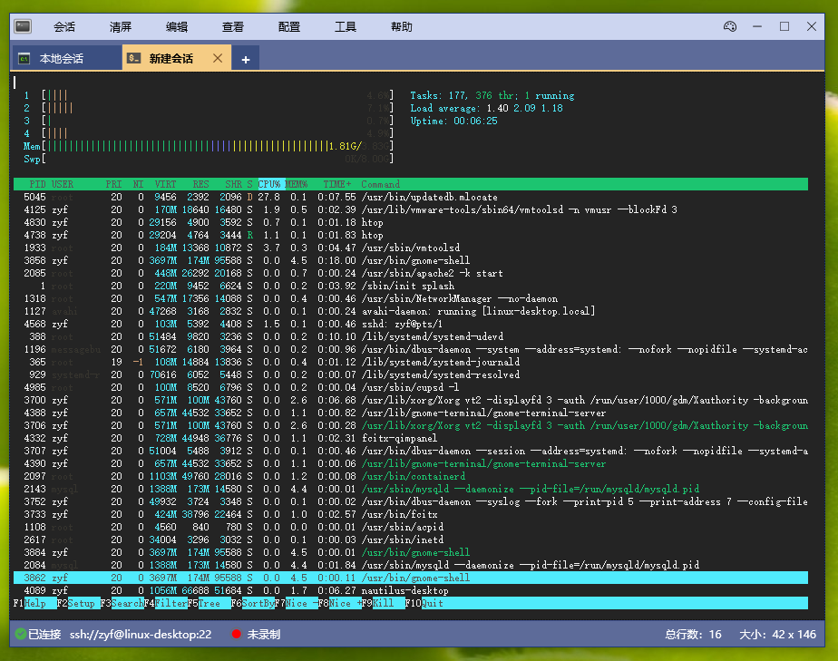
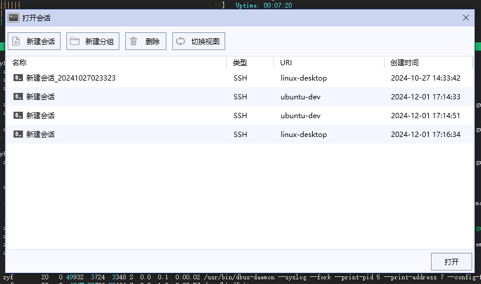
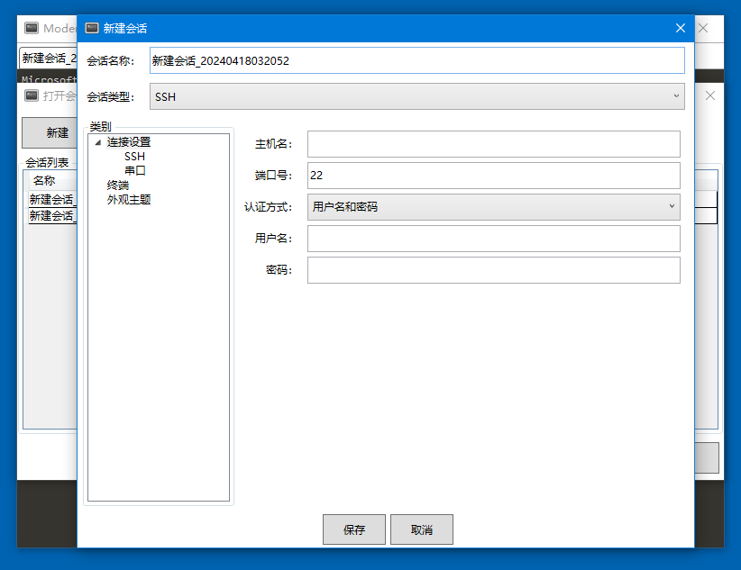

# ModengTerm - simple and powerful terminal emulator

ModengTerm is a terminal emulator developed using WPF, which has powerful features similar to XShell and is open source and free to use. Its ultimate goal is to serve as a replacement for XShell, providing you with a free, secure, and reliable virtual terminal software.
ModengTerm has done a lot of things, such as parsing terminal sequences, text rendering, cursor rendering, text selection, scrolling history records, and so on... So its customizability is particularly high, and the complexity of the code is also relatively high.

## Main Features
- Support interaction with SSH servers, serial ports, and Windows command lines
- Can save session information for easy login next time
- Export historical records in txt and html formats
- Search for historical records based on keywords/regular expressions
- Synchronous input
- Can save historical records
- Highly customizable color themes
- Real time logging function

## Software UI

### MainWindow
  

### SessionList
  

### CreateSession
  

## Cross Platform
At present, ModengTerm can only run on Windows environment, and we plan to develop a Mac version in the future.  

## QQGroup：
**GroupNumber：862861851**  
  
