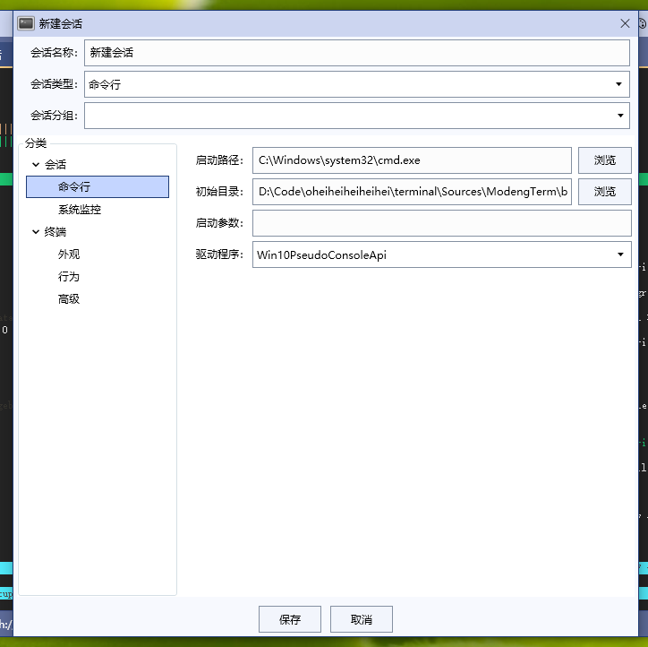

# ModengTerm - 简约，功能强大的终端模拟器

ModengTerm（读作“摩登Term”，意思是现代化的，时尚的终端）是一个终端模拟器。
它的目标是成为一个界面简约，不花里胡哨但是功能强大，配置灵活，让用户更易于使用的软件。

## 功能列表
- 支持与SSH服务器，串口，Windows命令行进行交互
- 可以保存会话信息，方便下次直接登录
- 选中终端内容并导出成txt，html格式
- 根据关键字/正则表达式进行历史记录的查找
- 向所有已打开的终端发送指令
- 同时打开多个终端窗口
- 终端历史记录
- 高度可定制化的颜色主题
- 实时记录日志功能

## 软件界面截图

### 主界面
  

### 会话列表
  

### 新建会话
  

## 跨平台支持
目前ModengTerm只能运行在Windows环境下，未来准备开发Mac版本。  

## 问题/功能交流QQ群：
**群号：862861851**  
  
