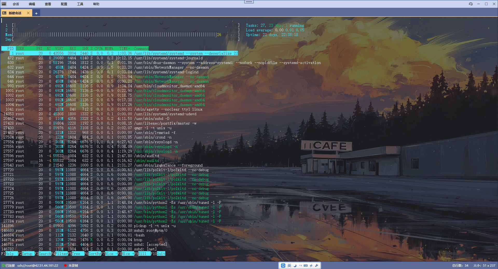

# ModengTerm - 简约，功能强大的终端模拟器

ModengTerm是一个用WPF开发的终端模拟器，它拥有类似于XShell的强大功能，并且它是开源和免费使用的。它的最终目标可以作为XShell的平替产品，让你拥有一个免费，安全，放心使用的虚拟终端软件。  
ModengTerm做了很多事情，解析终端序列，文本渲染，光标渲染，文本选中，历史记录滚动等等操作...所以它的可定制化程度特别高，代码的复杂度也比较高。

## 功能列表
- 支持与SSH服务器，串口，Windows命令行进行交互
- 可以保存会话信息，方便下次直接登录
- 终端内容导出成txt，html格式
- 根据关键字/正则表达式进行历史记录的查找
- 同步输入功能
- 历史记录
- 高度可定制化的颜色主题
- 实时记录日志功能

## 软件界面

### 主界面
  

### 会话列表
  

### 新建会话
  

## 跨平台支持
目前ModengTerm只能运行在Windows环境下，未来准备开发Mac版本。  

## 问题/功能交流QQ群：
**群号：862861851**  
  
